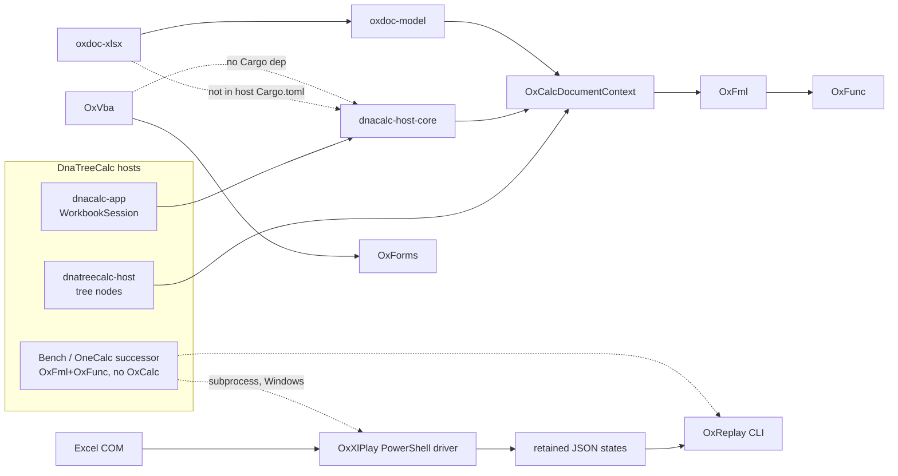
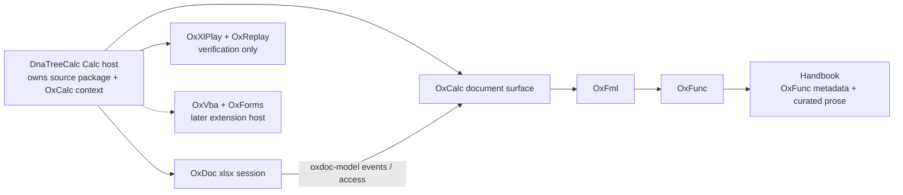

# DNA Calc Program Investigation Report

**Title:** Current state of the DNA Calc mutable Excel calculation path  
**Investigation date:** 2026-08-30  
**Investigator:** Grok 4.6 (xAI), read-only investigation under Foundation coordination role  
**Target:** repositories directly under `C:\Work\DnaCalc`  
**Status:** working note, not doctrine. Durable decisions still require the Foundation synthesis/promotion path.  
**Predecessor:** `PROGRAM_STOCKTAKING_20260503.md` (pre-DnaTreeCalc; this report supersedes that note as a *current-state* description, not as doctrine)

This document is the durable copy of the 2026-08-30 investigation. It is an investigation, a current-status assessment, an architectural and delivery strategy, a tactical next-action plan, and a basis for a follow-up DNA Calc campaign.

Evidence labels used throughout:

- **Observed** — directly evidenced in code, tests, commands, or current execution state
- **Documented** — stated in current repository documentation
- **Inferred** — a reasoned conclusion from evidence
- **Recommended** — proposed future action
- **Unknown** — could not be established

When sources disagree, the disagreement is stated explicitly.

---

## 1. Title and investigation date

DNA Calc Program Investigation — 30 August 2026.

Repositories inspected on disk (canonical names from the filesystem; none silently substituted):

`OxFunc`, `OxFml`, `OxCalc`, `OxDoc`, `DnaTreeCalc`, `DnaOneCalc`, `OxVba`, `OxForms`, `OxXlPlay`, `OxReplay`, `ExcelFunctionsHandbook`, `Foundation`, `OxIde`, `DnaOxIde`, `OxFunc-History`, plus 32 `OxVba-wt-*` directories and two Claude worktrees under `OxVba/.claude/worktrees/`.

`DnaVisiCalc` was ignored as instructed.

---

## 2. Executive summary

DNA Calc already has a **working mutable calculation core**. That is the central fact this investigation established, and it is not what Foundation’s original dual-engine, OpLog-first architecture described.

**Observed:** A host can create an in-memory workbook, enter literals and formulas, recalculate dependents (including cross-sheet formulas), and read published values through shared Ox-layer APIs.

Evidence: `DnaTreeCalc/src/dnacalc-host-core/src/demo.rs` builds a two-sheet demo entirely through `WorkbookSession::enter_grid_cell`; its tests assert `Sheet1!B1 = A1*10 = 10` and `Sheet2!A1 = Sheet1!A1+Sheet1!A5 = 6`. Command: `cargo test -p dnacalc-host-core --offline` in `DnaTreeCalc` → **51 passed**. The live product path is `dnacalc-app` → `dnacalc-host-core` → `OxCalcDocumentContext` → OxFml → OxFunc.

**Observed:** The missing product seam is not “an engine.” It is **file-backed workbook lifecycle**: open `.xlsx` through OxDoc, ingest into OxCalc, edit, recalculate, save, reopen. OxDoc can open packages (`oxdoc_xlsx::open_host_owned_xlsx_source`). OxCalc can ingest `oxdoc-model` events (`OxCalcDocumentContext::load_workbook_model` / `load_workbook_model_from_access`). DnaTreeCalc **does not depend on any `oxdoc*` crate**. W011 is the named host proof of that glue and is only 8/20 beads closed, while several of those remaining beads describe work that has already landed in code.

**Observed:** DnaOneCalc is archived (`DnaOneCalc/ARCHIVED.md`, HEAD `61e3979`, 2026-07-12). Its live role is the **Bench** product inside DnaTreeCalc (`dnacalc-bench-*`), F-gated to OxFml+OxFunc with **no OxCalc**. Treating DnaOneCalc as the next proving ground fights the archive.

**Observed:** Excel comparison infrastructure exists as file/CLI choreography (OxXlPlay PowerShell COM driver + OxReplay JSON/CLI), not as an in-process stack. OxXlPlay currently **fails to compile** against current OxFunc (`ValueTag::EmptyCell` missing in `oxxlplay-capture`). That is a live fidelity-path break.

**Recommended program direction:** make DnaTreeCalc’s Calc app the integration proving ground, and treat **open → edit → recalc → save → reopen of a small `.xlsx`** as the first campaign outcome. Protect the OxCalc document surface and the OxFunc/OxFml kernel. Do not revive DnaOneCalc. Do not lead with VBA, last-bit numeric campaigns, or handbook publication. Those are real lanes; they are not the integration bottleneck.

**First concrete integration outcome:**

> Open the W011 fixture `.xlsx` through OxDoc, ingest it into `OxCalcDocumentContext`, edit `A1` from 7 to 10 so `B1` recalculates to 30, save, and reopen with formula text preserved and cached `B1 = 30`.

---

## 3. Scope, method, limitations, and evidence hierarchy

### 3.1 Scope

The investigation concentrated on the main mutable Excel calculation path:

1. `OxFunc` — Excel function semantics and the value universe
2. `OxFml` — formula grammar, parsing, binding, and evaluation
3. `OxCalc` — calculation coordination, dependencies, invalidation, epochs, and mutable recalculation
4. `OxDoc` — workbook/document representation and mutation
5. `DnaTreeCalc` — multi-node/tree and increasingly workbook-capable host
6. `DnaOneCalc` — focused/single-formula host (archived; successor is Bench inside DnaTreeCalc)
7. `OxVba` — VBA execution
8. `OxForms` — VBA/UserForms runtime and hosting

Also inspected: `OxXlPlay`, `OxReplay`, `ExcelFunctionsHandbook`, `Foundation` (doctrine/historical intent only), `OxIde`, `DnaOxIde`, `OxFunc-History`, and OxVba worktrees.

Each relevant repository’s `AGENTS.md` was read and its local reading order followed as far as needed for current-state assessment. Sibling repos were treated as read-only. No `.beads/` files were edited. No commits, branches, handovers, or beads were created during the investigation. This report file is a separately authorized write into Foundation notes.

### 3.2 JSM skill selection

The investigation began with the named JSM capability `choose-the-best-skills-for-me-to-run-in-this-project`.

| Step | Result |
|---|---|
| `jsm search choose-the-best-skills-for-me-to-run-in-this-project` | Found, v1, ID `3206f46b-ec6f-4741-9617-91922eba33a1` |
| `jsm show` / `jsm info` | Inspected before use |
| Prior installed skills | `agent-fungibility-philosophy` v4, `beads-workflow` v4 |
| Install of named starter | Performed because the user asked to run/invoke it |
| Further installs | **Not performed** |

The starter skill’s normal outputs are two docs under a target `docs/`. The investigation request forbade modifying DNA Calc repositories, so those two docs were **not** written into lane repos. This Foundation note is the durable report the user later authorized.

**Permission envelope actually used:**

| Grant | Decision |
|---|---|
| Target | `C:\Work\DnaCalc` program, multi-repo |
| Write skill-selection docs into DNA Calc `docs/` | Denied during investigation |
| Remote cass | Denied |
| Authenticated jsm catalog | Used |
| Install further skills | Denied except the named starter |
| Commit | Denied during investigation |

Referenced engines (`codebase-archaeology`, `codebase-report`, `reality-check-for-project`, `cass`, `idea-wizard`) were **not installed**. Inline fallbacks from that skill’s `ORCHESTRATION.md` were used: documentation-then-entry-points-then-data-flow; vision-vs-code WORKING/PARTIAL/STUB/UNPROVEN marking; 30→5→10 pairing in synthesis.

**RUN NOW portfolio applied to this investigation:**

1. Reality-check against charters vs compiling code and tests.
2. Codebase archaeology/report fallbacks, via parallel read-only explore agents.
3. `agent-fungibility-philosophy` only as a coordination pattern for those agents.

No bulk install. Local Excel-DNA / `roscli` capabilities were noted and not required for this pass.

Candidate skills inspected with `jsm search`/`jsm show` and **not** installed:

- `reality-check-for-project` v3
- `codebase-report` v5
- `codebase-archaeology` v1
- `codebase-audit` v2
- `mock-code-finder` v1
- `planning-workflow` v6
- `testing-conformance-harnesses` v3
- `git-repo-janitor` v7
- `git-worktree-branch-rationalization` v7
- `simplify-and-refactor-code-isomorphically` v10

### 3.3 Evidence hierarchy

Preferred order, as required:

1. Compiling/running code and executable behavior (this session’s cargo tests)
2. Tests, fixtures, conformance results, replay evidence, verification scripts
3. Current crate/package manifests and public interfaces
4. Recent implementation history and commits
5. Live execution state (beads, worksets, handovers, open issues)
6. Current repository-level specifications and design documents
7. Older plans and Foundation doctrine

Foundation was read (`CHARTER.md`, `ARCHITECTURE_AND_REQUIREMENTS.md`, `OPERATIONS.md`, `AGENTS.md`, `REPLAY_APPLIANCE.md`) and treated as doctrine, historical intent, architectural framing, and a source of hypotheses — **not** as the primary description of current implementation state.

### 3.4 Method

- Repository inventory: git HEAD, commit counts, dirty trees, Cargo.toml members, path deps, beads presence.
- Direct reads of AGENTS/CHARTER/README/OPERATIONS/workset registers and public `lib.rs` surfaces.
- Parallel read-only explore agents per cluster (OxFunc; OxFml; OxCalc; OxDoc; hosts; OxVba/OxForms/worktrees; fidelity/handbook/Foundation).
- Proportionate cargo tests in OxFunc, OxFml, OxCalc, OxDoc, DnaTreeCalc `dnacalc-host-core`, OxReplay, OxXlPlay.
- `br ready`, `br list --status in_progress`, `br epic status` in repos with `.beads/`.

### 3.5 Limitations

- Full `cargo test --workspace` was **not** run for DnaTreeCalc (WASM/UI size), OxVba, or OxForms.
- `cargo clippy --workspace -- -D warnings` was **not** run (DnaTreeCalc already records ~314 clippy errors on `dnatreecalc-host` in beads).
- `cargo fmt --check` was **not** run.
- Live Excel COM observation was **not** re-run.
- Lean/TLA+ builds were **not** re-run.
- OxVba worktree unique-commit archaeology (`git log master..<wt>`) was **not** completed.
- Handbook `efh` C# tests were **not** run.
- `DnaCalc` is not itself a Cargo workspace; cargo must be run per repo.

---

## 4. DNA Calc repository map

### 4.1 Folders under `C:\Work\DnaCalc`

| Folder | Git | Commits | HEAD (date) | Cargo | Beads | Role |
|---|---|---:|---|---|---|---|
| `Foundation` | yes (`master`) | 66 | `e6cfe71` 2026-06-25 | no | no | Doctrine / coordination |
| `OxFunc` | yes (`main`) | 743 | `9baaf21` 2026-08-23 | yes | yes | Function kernels + value universe |
| `OxFml` | yes (`main`) | 220 | `8bace71` 2026-07-12 | yes | yes | Formula language + evaluator |
| `OxCalc` | yes (`main`) | 790 | `752a269d` 2026-07-12 | yes | yes | Multi-node/grid calc engine |
| `OxDoc` | yes (`main`) | 119 | `786ef0c` 2026-07-11 | yes | yes | OOXML file boundary |
| `DnaTreeCalc` | yes (`main`) | 751 | `8d0beb7` 2026-07-23 | yes | yes | Live host (Bench + Calc + tree) |
| `DnaOneCalc` | yes (`main`) | 283 | `61e3979` 2026-07-12 | yes | yes | **Archived** into DnaTreeCalc |
| `OxXlPlay` | yes (`main`) | 35 | `e8c4791` 2026-05-23 | yes | yes | Excel observation |
| `OxReplay` | yes (`main`) | 39 | `6e880ac` 2026-05-24 | yes | yes | Replay/diff/explain CLI |
| `OxVba` | yes (`master`) | 3555 | `9b553334` 2026-08-19 | yes | yes | VBA compiler/runtime |
| `OxForms` | yes (`master`) | 308 | `ddf8042` 2026-07-15 | yes | yes | MSForms runtime |
| `ExcelFunctionsHandbook` | yes (`main`) | 20 | `307fc6a` 2026-08-09 | tools only | no | Public function handbook |
| `OxIde` | yes (`main`) | 302 | `cbfe710` 2026-05-29 | yes | yes | VBA IDE |
| `DnaOxIde` | **no** | — | — | no | no | Design mockups only |
| `OxFunc-History` | yes (`main`) | (transcript archive) | `e1b810e` 2026-07-19 | no | no | Private session transcripts |
| `OxVba-wt-*` | 32 git worktrees of OxVba | — | July 2026 SHAs | — | — | Leftover AutoRun worktrees |
| `DnaVisiCalc` | yes | — | — | yes | — | **Out of scope** |

### 4.2 Dirty working trees at investigation time (**Observed**)

| Repo | Dirty / extra |
|---|---|
| OxFunc | untracked `smart-fuzzer/tools/__pycache__/`, `calc_graph_racer/target-accrint-root/` |
| DnaTreeCalc | modified `.gitignore`; deleted `src/dnacalc-app/dist/.gitkeep`; extra Claude worktree `.claude/worktrees/modest-nobel-989bb3` at detached `d9a2e17` |
| OxVba | modified `.beads/issues.jsonl` and `crates/oxvba-differential/tests/jit_portable_vm3_parity.rs`; 34 registered worktrees |
| OxForms | modified `.beads/issues.jsonl`, `.gitattributes` |
| ExcelFunctionsHandbook | modified `OPERATIONS.md`, `README.md` |
| OxIde | deleted `target/w355-engineering-review-showcase.html` |

### 4.3 Observed Cargo path-dependency direction

```text
OxFunc  ←  OxFml  ←  OxCalc  ←  DnaTreeCalc (host-core, tree host, calc app)
OxDoc/oxdoc-model  ←  OxCalc
OxDoc/oxdoc-xlsx   ←  (nobody outside OxDoc)
OxXlPlay           ←  oxfunc_value_types  (compile broken at HEAD)
ExcelFunctionsHandbook/tools/efh-*  ←  oxfunc_core
OxForms            ←  OxVba via git rev 8f1aecc (not local path, not master)
OxReplay           ←  no Ox* path deps; consumed by CLI from Bench
DnaOneCalc (frozen)←  oxfml_core, oxfunc_core, and live DnaTreeCalc shared crates
OxIde              ←  OxVba crates (optional)
```

Exact path-dep citations:

- `OxFml/crates/oxfml_core/Cargo.toml`: `oxfunc_core = { path = "../../../OxFunc/crates/oxfunc_core" }`
- `OxCalc/src/oxcalc-core/Cargo.toml`: `oxfml_core`, `oxfunc_core`, `oxdoc-model`
- `DnaTreeCalc/Cargo.toml` workspace deps: `oxcalc_core`, `oxfml_core`, `oxfunc_core`
- `DnaTreeCalc/src/dnacalc-host-core/Cargo.toml`: `oxcalc_core`, `oxfunc_core`, `dnacalc-skin-ir` — **no oxdoc, no oxfml direct, no oxreplay, no oxvba**
- `DnaOneCalc/src/dnaonecalc-host/Cargo.toml`: `oxfml_core`, `oxfunc_core`, plus DnaTreeCalc `dnacalc-skin-ir` / formula-ux / extension-host
- `OxXlPlay/Cargo.toml`: `oxfunc_value_types = { path = "../OxFunc/crates/oxfunc_value_types" }`
- `ExcelFunctionsHandbook/tools/efh-ingest/Cargo.toml` and `efh-battery/Cargo.toml`: `oxfunc_core`
- `OxForms/Cargo.toml` workspace metadata pins OxVba git `8f1aeccc683c4d41621bf137574b8a4d11bd9845`

### 4.4 Comparison with May 2026 stocktaking

`PROGRAM_STOCKTAKING_20260503.md` recorded that `DnaTreeCalc` did not yet exist, listed DnaOneCalc as a live host, and did not list OxDoc, OxForms, or ExcelFunctionsHandbook. **Observed now:** DnaTreeCalc is the live host (751 commits), DnaOneCalc is archived, OxDoc/OxForms/Handbook exist and matter.

---

## 5. Current end-to-end architecture

### 5.1 Observed current system



**Observed meaning of “mutable Excel calculation engine” today:** an in-memory OxCalc document/workspace whose authored cells and tree nodes can be edited, dirtied, scheduled, evaluated through OxFml/OxFunc, and republished with epochs/ticks. Persistence of that workbook as `.xlsx` is specified and implemented on each side of the file/engine boundary, but **not joined in a host**.

### 5.2 Documented intended architecture (Foundation)

Foundation `ARCHITECTURE_AND_REQUIREMENTS.md` still describes:

- two independent engines (Rust and .NET) sharing identical protocol surfaces
- OpLog / DocSnapshot / CalcDeltas as three hard boundaries
- Green stack: Lean + TLA+ + OCaml oracle + conformance packs
- host ladder VbCalc → OneCalc → TreeCalc → PreCalc → SuperCalc → DNA Calc

**Observed disagreement:** lane work is Rust-first; there is no second live delivery engine on the mutable calc path; OxCalc owns live workbook mutation rather than a universal OpLog; DnaOneCalc is archived; DnaTreeCalc already hosts a grid workbook session; OxXlPlay/Handbook/OxDoc/OxForms are first-class and mostly absent from Foundation’s original component map.

### 5.3 Target architecture (**Recommended**, where it differs)



The change is not a new engine. It is **one host-owned document lifecycle** over APIs that already exist, with replay as a verifier rather than a second product host.

---

## 6. Repository-by-repository findings

Status shorthand used here: **Working** = exercised beyond scaffolding; **Partial** = real code, incomplete product claim; **Planned** = specified, not landed; **Obsolete** = docs/APIs superseded; **Isolated** = compiles (or compiled) but not on the live host path; **Broken** = does not currently build.

### 6.1 OxFunc — Working (numeric exactness Partial)

**HEAD:** `9baaf21` 2026-08-23 — “Expand firehorse ERFC campaign to 26-bit PQR+t cubes…”  
**Workspace:** `crates/oxfunc_core`, `crates/oxfunc_value_types`. Edition 2024.

**Documented mission** (`CHARTER.md`): bit-exact Excel identity for 517 in-scope rows (494 functions + 23 operators; 17 deferred), plus registry, coercion, array lift, FEC metadata, Lean obligations.

**Observed public surface** (`crates/oxfunc_core/src/lib.rs`): `capability`, `coercion`, `function`, `function_call`, `functions`, `host_info`, `locale_format`, `registry`, `resolver`, `semantic_kernel`, `value`, `xll_export_specs`. `excel_numeric` is crate-private unless `research-x87`.

**Value universe (Observed)** in `oxfunc_value_types`, re-exported by `oxfunc_core::value`: `CoreValue` (Number / Text UTF-16 / Logical / Error / Empty / Missing / Array / Reference); `CalcValue { core, rich }`; worksheet error codes including Spill/Calc/Field/Blocked/Connect; `ReferenceLike`.

**Function counts:**

| Count | Kind | Source |
|---|---|---|
| 525 | Live registry rows | **Observed** comment in `catalog_conformance.rs`: `525 = 229 placeholder_signature + 22 operator_surface + 0 known_missing_help + 274 complete` |
| 534 | Published V1 snapshot | **Documented** CHARTER; CSV `OXFUNC_LIBRARY_CONTEXT_SNAPSHOT_EXPORT_V1.csv` stamped `2026-04-02` / `87ef585` / **dirty** |
| 517 / 17 | In-scope vs deferred | **Documented** CHARTER + W050 deferred inventory |
| 229 | Placeholder signatures | **Observed** catalog ratchet |
| 16 | Open Category-2 Excel discrepancies | **Documented** `OXFUNC_EXCEL_DISCREPANCY_CATALOG.md` (reconciled 2026-08-19) |
| 4 | W051 residual rows | **Observed** CSV: `OP_UNION_REF`, `AREAS`, `INDEX`, `RATE` |
| 38 | “function-phase-complete” | **Documented only** in `AGENTS.md` / `OPERATIONS.md` as mature-repo calibration. **Not** a live enumerated catalog. |

**Inferred:** almost the full Excel function/operator surface is implemented and dispatched. Current work is bit-exact calculation-graph identification (W109), not “add missing SUM.” Doctrine `function-phase-complete` is not honestly true for the whole 517-row set; the “38 complete” line is historical.

**This session tests:** `cargo test --workspace --offline` in OxFunc:

```
test result: FAILED. 1548 passed; 1 failed; 4 ignored
failures: functions::discrete_dist_family::tests::finite_combinatoric_witnesses_match_excel_bits
assertion left == right failed: 0.6846054400000001 vs 0.68460544
  left:  4604341597154236046
  right: 4604341597154236045
```

File: `crates/oxfunc_core/src/functions/discrete_dist_family.rs:911`. This is a 1-ULP Excel-bits failure, not a compile failure.

**Lean:** `formal/lean/OxFunc/Functions/` is large (ABS through XOR families, including `Sum.lean`). `Sum.lean` kernel is a rational left fold (`nums.foldl (fun acc n => acc + n) 0`), not bit-exact Excel.

**Recent git theme (last 15):** W109 black-box graph search — ERFC body campaigns, x87 last-bit dumps, NORMSDIST/GAUSS wrappers, ASINH/ACOSH identifications.

**Beads (Observed `br`):**

Ready (excerpt): `oxf-fckb` PMT/PPMT exactness; `oxf-ypq2.12` W093 OxFml registry lookup; `oxf-ahi7` portable Lambda boundary; `oxf-51fn` W098 CalcValue epic; numeric drift bugs (YIELD, ODDFPRICE, XNPV, CHISQ.TEST, FORECAST, ERFC).

In progress: `oxf-jwh5` W109 epic (9/11 children closed); `oxf-jwh5.10` IRR; `oxf-jwh5.3` catalog reconcile; `oxf-wpzw.1` W108-A; `oxf-oyrz.1/.2` W104; `oxf-acdw.1` W100 seam.

**Mess:** WORKSET_REGISTER dated 2026-04-06 and does not list W108/W109; V1 snapshot vs 525-row live registry vs handbook 541; leftover toy `Value` beside `CalcValue` in value-types; `target-*` experiment trees; W071 “517/517 witness” closed beads vs 16 live discrepancy rows.

**Consumers (Observed):** OxFml, OxCalc, DnaTreeCalc, DnaOneCalc frozen host, handbook ingest, `tools/xll-addin/oxfunc_xll`.

### 6.2 OxFml — Working (Excel-complete Partial)

**HEAD:** `8bace71` 2026-07-12 — calc-a4x2 Arc-share + Cow context maps.  
**Workspace:** single crate `oxfml_core`. Toolchain pinned 1.94.1. `unsafe_code = forbid`.

**Documented mission:** formula grammar, parse, bind, single-node evaluation, canonical owner of FEC/F3E evaluator-side contract.

**Observed public surface** (`crates/oxfml_core/src/lib.rs`): `binding`, `carrier`, `consumer`, `eval`, `format`, `interface`, `publication`, `red`, `scheduler`, `seam`, `semantics`, `source`, `syntax`. Ordinary consumer entry is `consumer::{runtime, editor, replay}`. `host` / `session` / `oxfunc_adapter` demoted to `test_support`.

**Working floor (Observed):** lexer + recursive-descent parser; bind including 3D sheet spans; compiled `CompiledFormulaPlan`; OxFunc `FunctionCallTarget` dispatch; LET/LAMBDA/IF special forms; prepared execute (`execute_prepared`); bounded format/CF publication.

**Not claimed:** full Excel grammar; pack-grade coordinator replay; production grid grammar shipped in OxFml (OxCalc owns `StrictExcelGridReferenceProfile`). Local `cell_values` map is test scaffolding when no `ReferenceSystemProvider` is injected.

**EvaluationBackend:** default `OxFuncBacked`. `LocalBootstrap` remains and **errors on function calls** — leftover, not the live host path.

**This session tests:** `cargo test --workspace --offline` **passed** (many test binaries; 1 ignored W075 manual hot-loop perf fixture).

**Active blocker:** `CURRENT_BLOCKERS.md` BLK-FML-004 — FTC-0902 `LET(row,…)` collides with builtin `ROW`; last reviewed 2026-06-04.

**Beads:** ready includes `fml-ldv` (W076 drill trace, epic 100% closed — lag), `fml-oh8.2`, `fml-ds0.20.1`. In progress: `fml-ds0` (also 100% closed / eligible), `fml-h1l` parser trivia, `fml-f64` host syntax hook, `fml-785` non-formula entries.

**Stale docs:** `IN_PROGRESS_FEATURE_WORKLIST.md` last updated 2026-05-24, missing W077/W078/runtime perf; W001/W002 still marked as if grammar were narrow; W078 header vs implementation; bead `fml-k9s` still saying 3D is planned after it landed.

**Identity ownership (Observed):** host supplies `formula_stable_id`; OxFml derives `FormulaToken` fence from stable id + text version + channel + text. Bind adds green-tree/bind hashes and W077 identities.

### 6.3 OxCalc — Working (Stage-2/concurrency/formal Partial)

**HEAD:** `752a269d` 2026-07-12 — calc-a4x2 diagnosis + dead-map cleanup.  
**Workspace:** `src/oxcalc-core`, `src/oxcalc-tracecalc`, `src/oxcalc-tracecalc-cli`.

**Documented mission:** coordinator, scheduling, invalidation, epoch-safe publication. Out of scope: formula grammar, function kernels, UI/file adapters.

**Observed modules** (`src/oxcalc-core/src/lib.rs`): `authored_delta`, `consumer`, `coordinator`, `dependency`, `formula`, `grid`, `oxdoc_ingest`, `oxfml_session`, `recalc`, `recalc_wave`, `structural`, `treecalc`, `value_cache`, `workspace_revision`, and others.

**Host API:** `OxCalcDocumentContext` in `consumer.rs`, renamed from `OxCalcTreeContext` in W062 R5.8 (`calc-5kqg.53`). Document surface verbs include `enter_grid_cell`, `set_grid_cell_value`, `clear_grid_cell`, `bind_grid_formula`, `recalculate_workbook` (F9), defined-name lifecycle, `load_workbook_model`, `load_workbook_model_from_access`.

**Two live calculation lanes (Observed, not one scheduler object):**

| Lane | What recalculates | Evaluator |
|---|---|---|
| Tree | Formula-bearing `TreeNodeId`s in topo order | OxFml session in `treecalc.rs` |
| Grid (optimized) | Dirty cone on `GridOptimizedSheet` | OxFml + valuation/plan cache |
| Grid (oracle) | Same authored sheet via `GridCalcRefSheet` when validation mode says so | OxFml; differential vs optimized |
| Workbook join | Cross-sheet cell/name edges + tree-node names into grids | One `WorkbookRecalcTick` |

**Dirtying:** tree `InvalidationSeed` → `DependencyGraph::derive_invalidation_closure`; grid `GridDirtySeed` accumulated on edit; Manual mode mutates authored truth, marks `Stale`, does not evaluate until F9.

**Epochs (several distinct notions):** grid `recalc_epoch` / per-cell `value_epoch`; tree `publication_value_epoch`; `WorkbookRecalcTick` for coherent `NOW()`/`RAND*`; snapshot-layer IDs as identity fences.

**Ingest:** `oxdoc_ingest.rs` implements `OxCalcIngestSink`. Exhaustive match over `OxCalcDocumentFeature` with **no wildcard** (D4 §12 honesty). Load binds and seeds caches but does **not** open-recalc except via R6.5 policy: Automatic issues one open-recalc; Manual keeps `FileCached` until `recalculate_workbook`.

**This session tests:** `cargo test --workspace --offline` **passed** — 1269 passed / 2 ignored in the main lib suite, plus further integration tests. `consumer.rs` ~31.5k lines (tests from ~11367). `grid/machine.rs` ~28.4k lines.

**Beads:** W062 epic `calc-5kqg` **67/69 children closed (97%)**. Ready includes cycle-engine design, W056 replay gaps, W059 authored-input epic, tree warm incremental `calc-a4x2`, W061 grid-ref planning. In progress: `calc-4vs8.5.1` CTRO intake, `calc-4vs8.33` non-table corpus.

**Documented vs observed host names:** consumer comments and some DnaTreeCalc docs still say `OxCalcTreeContext`; code is `OxCalcDocumentContext`. `CORE_ENGINE_ARCHITECTURE.md` still talks TreeCalc-first / no grid while W062 already runs workbook grids.

**FEC/F3E:** OxCalc copies are **mirrors**; canonical is `OxFml/docs/spec/fec-f3e/`. Mirror provenance still mentions DnaVisiCalc.

**Formal:** Lean/TLA+ exist under `formal/`. Register: W049 formal restart **depends on W062**. Treat existing formal artifacts as predecessor inventory, not proof of the current workbook engine.

### 6.4 OxDoc — Working as file boundary; Isolated from hosts

**HEAD:** `786ef0c` 2026-07-11 — toolchain 1.94.1 pin. Last product wave: W009 review metadata (closed 2026-06-29), then W062 `WorkbookHeader.iterative_calc`.

**Crates:** `oxdoc-model` (types-only, serde, no I/O, no OxCalc dep); `oxdoc-xlsx` (ZIP/XML, ~26k-line `lib.rs`); `oxdoc-conformance`; `oxdoc-cli`.

**Open (Observed):** `read_package` / `read_events` / `open_host_owned_xlsx_source`. ZIP fully ingested into RAM (`SourcePackageManifest`), then profile-gated XML parse. Profiles: `values_only()`, `strict_values_only()`, `full()`, `empty()`.

**Lazy meaning:** retained source bytes + on-demand XML materialization. **Not** incremental XML token index, mmap, or dirty-block save.

**Save (Observed):** conservative round-trip. Supported: no-op preservation; existing non-formula cell value replace; existing formula text/cached value if topology unchanged (drops `xl/calcChain.xml`); narrow structure/control/review/CustomXML/VBA-module-source edits. **Rejected:** cell add/remove; formula add/remove; sheet add/remove/rename/reorder; unmaterialized edits that would stale source.

**This session tests:** 24 (cli) + 60 (conformance) + 43 (model) + 182 (xlsx) passed.

**Consumers:** OxCalc path-deps **only** `oxdoc-model`. **No** DnaTreeCalc/DnaOneCalc/OxReplay/OxXlPlay Cargo.toml references `oxdoc`.

**Beads:** one ready P4 design question `oxdoc-10j`. No open epics. W062 gaps 2–4 (cell edits, streaming ingest, sheet reorder) live in handover text, not beads.

### 6.5 DnaTreeCalc — Working host substrate; .xlsx Partial

**HEAD:** `8d0beb7` 2026-07-23 — S4.P2 tree model layer moved into host-core.

**Charter (Documented):** “tree of named formulas”; “Not a grid.” Dated mark (2026-07-02) points at dual-profile decision and W011. Full charter amendment still pending.

**Workspace (Observed `Cargo.toml`):** host-core, formula UX, skins, stages (notebook/atlas/sheet), bench crates imported from DnaOneCalc (`dnaonecalc-*` → `dnacalc-bench-*`), `dnacalc-app` / `dnacalc-app-desktop`, arch gates. Comment: “Source repo is archived.”

Three products in one workspace:

| Product | Engine | Persistence today |
|---|---|---|
| Bench (`dnacalc-bench-*`) | OxFml+OxFunc; F-gate forbids OxCalc | formula/workspace JSON |
| Calc (`dnacalc-app` + host-core) | OxCalc workbook | **in-memory demo only** |
| Tree (`dnatreecalc-host`) | OxCalc tree context | `.dnatree.json` |

**host-core (Observed `src/dnacalc-host-core/src/lib.rs`):** Leptos-free SessionEngine. `DocumentSession` enum: `RichTree` / `Workbook`. H2 comments: xlsx and worker **out of H2 scope**. H6: `EnterGridCell` / `ClearGridCell` end to end. `WorkbookSession` wraps `OxCalcDocumentContext`. Demo builder authors every cell through `enter_grid_cell`.

**This session tests:** `cargo test -p dnacalc-host-core --offline` → **51 passed**.

**W011 (Documented `docs/WORKSET_REGISTER.md` + `docs/ux/DNACALC_HOST_CORE_XLSX_NOTEBOOK_PROOF.md`):** first visible reference host for open `.xlsx` through OxDoc, ingest to OxCalc, Skin IR notebook, edit A1, B1 shows 30, save/reopen with cached 30. Status OPEN. Epic `dtc-hj2` **8/20 closed (40%)**. Ready still includes `dtc-hj2.3` “create Leptos-free dnacalc-host-core skeleton” — **the crate exists**. Beads lag code.

**Other beads:** S4 Model `dtc-c0wf` 2/30; frontend `dtc-ajl` 15/31; Bench redesign `dtc-lfz` 9/13; W004 `dtc-z0i` 15/18 in progress; W003 epic 100% closed but workset register still OPEN; W010 UDF epic 100% closed while workset register OPEN; sample beads `dtc-pg91` / `dtc-juyd` pollute ready.

**No oxdoc, oxreplay, oxvba Cargo deps (Observed grep).**

**README (Documented) still describes early W002 bootstrap** — stale vs HEAD.

### 6.6 DnaOneCalc — Obsolete as a development repo

**HEAD:** `61e3979` 2026-07-12 — “Archive repo: merged into DnaTreeCalc @ c68ecaa per D5”. Live tree as of `c113088`.

**ARCHIVED.md (Observed):** do not develop here; file changes against DnaTreeCalc. Crates continue as `dnacalc-bench-*`. Docs/scripts/fixtures copied under `DnaTreeCalc/docs/onecalc/`, `scripts/onecalc/`, `fixtures/onecalc/`. `src_archive_ref/` was deliberately not imported (it had in-process OxReplay crate deps).

**Contradiction:** `AGENTS.md`, `README.md`, `docs/CHARTER.md` were not rewritten after archive. Frozen source still path-deps **today’s** TreeCalc shared crates (drift risk). Beads still show ready VBA/UX work (`dno-7vt4` WS-15 13/32, etc.).

**Vertical-slice script copied into TreeCalc is marked STALE:** `scripts/onecalc/run-vertical-slice-smoke.ps1` still calls `dnaonecalc-host --shell-smoke`.

### 6.7 OxXlPlay — Partial, currently Broken

**HEAD:** `e8c4791` 2026-05-23. 35 commits.

**Documented:** Excel observation harness; not a semantics lane.

**Observed crates:** abstractions, scenario, capture, provenance, bridge, bundle, CLI (`dna-xl-play`). CLI `oxxlplay-cli` depends **only** on `oxxlplay-scenario`. Live Excel path is `scripts/invoke-excel-observation.ps1` (COM). Advertised commands `validate-scenario`, `fingerprint-env`, `emit-bundle`, `emit-diff-seed`, `validate-handoff` print scaffolded and exit 2.

**Retained states:** `states/excel/` includes values/formulae, SpreadsheetML formatting, structured references, table construction/update oracles, VBA UDF AddThem, provenance fingerprint.

**This session tests:** **compile failure**

```
error[E0599]: no variant or associated item named `EmptyCell` found for enum `ValueTag`
   --> src\oxxlplay-capture\src\lib.rs:276:59
OxFuncAlignedValueWire::EmptyCell => Ok(ValueTag::EmptyCell),
```

**Inferred:** OxFunc value-types moved; OxXlPlay was not rebuilt against current OxFunc. Excel compare at HEAD is not a live gate.

**Beads:** one ready `oxxlplay-4nd` W056 fixtures. No open epics. `CURRENT_BLOCKERS.md`: none (last reviewed 2026-05-23) — does not record the compile break.

### 6.8 OxReplay — Working as JSON/CLI mechanics; Isolated from Calc app

**HEAD:** `6e880ac` 2026-05-24. 39 commits.

**Crates:** abstractions, bundle, core, diff, explain, distill, governance, conformance, `oxreplay-dnarecalc-cli` (`dna-recalc`).

**This session tests:** workspace tests passed (small suites: 5+4+13+27+3+4+6+3, several 0-test members).

**Adapters are JSON projections + manifest validation, not a plugin SDK (Observed).** OxCalc TraceCalc C4 claim is rejected (`BLK-REPLAY-002`, empty `lifecycle_states`). OxFml C0–C3 accepted, C4 scaffolded. OxFunc packet adapter **not ingested**. OxXlPlay manifests have `adapter_id` but no capability claim; `projection_status=lossy`. Distill is toy (predicate string contains `"unstable"`).

**No `oxreplay-*` path dep from OxCalc/OxFml/OxFunc/current hosts.** Bench invokes CLI as subprocess. Archived OneCalc `src_archive_ref` *did* path-dep OxReplay crates.

**README still says** `src/`, `tests/`, `tools/` “to be populated as implementation advances” — stale vs existing crates.

**Beads:** ready blocker `oxreplay-p1w` BLK-W007 missing host-rollout artifacts. No open epics.

### 6.9 OxVba — Working VBA engine; Isolated from calc

**HEAD:** `9b553334` 2026-08-19. 3555 commits. Branch `master`.

**Pipeline (Observed):** `.basproj/.vbp` → project → symbol → syntax CST → bind CoreProgram → oxir `.oxi` → `oxvba-vm3` or `oxvba-jit` (Cranelift, no VM fallback). Product sessions are VM3-only (`ProjectRuntimeSession`).

**Working subset:** parse/bind/OxIR; VM3; portable JIT (declines COM/Declare/pointers); Collection/Variant/BSTR/SAFEARRAY; project events; CLI `oxvba run`; WrappedComServer.

**Not on calc path:** no Cargo dep from OxCalc/OxFml/DnaTreeCalc. Old `HostUdf*` / `PreparedVbaProject` APIs **do not exist** in current crates. DnaOneCalc `HANDOFF_OXVBA_TYPED_UDF_INVOCATION.md` and WS-15 still describe them.

**Excel oracle:** captured JSON replay works; live WIN-14 cert planned; `BLK-WINDOWS-CERT-001` environment. AGENTS.md UIA doctrine vs older `run_oracle.ps1` still using `Application.Run`.

**Beads:** AutoRun umbrella `bd-59co` open. Ready: WIN-3/WIN-9 rollout, Linux CI baseline, WIN-0 certify, WIN-14 Excel oracle/VM. `bd-ivaha` improvement cycle 27/38 closed. Last-touched bead created 2026-08-23 may be ahead of last commit.

**Worktrees (Observed `git worktree list`):** 34 registered — canonical + 2 Claude + 32 `OxVba-wt-*` Codex trees from ~2026-07-11–14. Claude pensive HEAD = `8f1aecc` (OxForms pin). ~6–7 weeks stale vs master. Mess risk high for hygiene, medium for unique unmerged commits (**Unknown** without merge-base). Also `temp/dotnet_runtime_src` vendored .NET sources.

### 6.10 OxForms — Partial, real consumer of OxVba

**HEAD:** `ddf8042` 2026-07-15. Pins OxVba git `8f1aecc`, **not** master `9b55333`. Policy: committed manifests use pinned git; path overrides are local-only.

**Crates:** `oxforms-pal`, `oxforms-pal-win`, `oxforms-oxvba-adapter`, `oxforms-headless-runner`, `oxforms-bootstrap`. Version `0.0.0`.

**Working slice:** W007 greeter + W009 showcase — real window, Scene self-render, native VBA handlers. Not full UserForm.Show / default-instance / FormModule / production `.frm` codec.

**W010:** epic `oxforms-jbjp` 5/72 children closed. In progress: `oxforms-jbjp.5` generalize live MSForms oracle. Ledger **Documented**: 7,753 rows, `green = false`.

**Handover** `HANDOVER_OxVba_w010_form_module_integration.md` is cited but **missing** from `docs/handovers/` (**Observed**).

### 6.11 ExcelFunctionsHandbook — Partial knowledge system

**HEAD:** `307fc6a` 2026-08-09. Local working tree dirty (`OPERATIONS.md`, `README.md`). Completeness audit dated 2026-08-24.

**Charter:** independent knowledge system; OxFunc is strongest evidence source, not definition; Gneiss ledger; 541 entries = 518 functions + 23 operators = 534 published rows + 7 split byte-variant rows.

**On disk vs charter:**

| Organ | Charter | On disk |
|---|---|---|
| `data/` | Mechanical OxFunc projection | 541 function JSON + batteries; mixed vintage |
| `content/functions/` | Curated pages | **375** md files; 166 unauthored |
| `ledger/` | Gneiss DB + JSONL | `VOCABULARY.md` only |
| `site/` | Generated pages + `/coverage` | mockups + pre-ledger `site/api/rubric.json` |
| `implementations/`, `vectors/` | Suite-verified | empty |
| `tools/` | ingest / ledger / site | `efh-ingest` (Rust, path-dep OxFunc), `efh-presence`, `efh-battery`, `efh` C# rubric |

**Critical content gap:** `FUNC.SUM.md` does **not** exist. SUM has `data/functions/FUNC.SUM.json` (`xlfSum`, arity 1–255), OxFunc kernel, and Lean `Sum.lean`.

**Sync doctrine:** `efh-ingest --diff` rebuilds `data/` only; steward should append ledger claims — but there is no ledger. Mixed vintage published: CSV spine `87ef585` dirty 2026-04-02 + live registry `473efa3`. Four `FORECAST.ETS*` functions outside the 541 spine (`EFH-HO-002`).

**No AGENTS.md.** No beads.

### 6.12 Foundation — Doctrine only

**HEAD:** `e6cfe71` 2026-06-25. 66 commits. C# tools include `excel-probe`, `excel-rtd-server`, `corpus-monitor`, `JobGuard`, `spec-pack-processor` — a **second Excel-driver lineage** beside OxXlPlay.

Foundation remains doctrine, architecture, operations, replay-governance, and cross-repo coordination. It is **not** a description of the 2026-08 implementation. Replay registries in lanes still pin `foundation.replay.authoritative-pass-01.2026-03-15`.

### 6.13 OxIde / DnaOxIde / OxFunc-History

- **OxIde:** real VBA IDE (Tauri + `oxide-*`), HEAD 2026-05-29. Integration docs still name **DnaOneCalc** as first embed host. Frozen OxVba copy under `.external/oxvba-frozen`.
- **DnaOxIde:** not a git repo; DesignMockup/DesignPrototype only.
- **OxFunc-History:** private gzipped Claude transcripts for public OxFunc; not a product.

---

## 7. Integration status of the mutable calculation path

### 7.1 End-to-end capability matrix

| Capability | Status | Evidence |
|---|---|---|
| Create in-memory workbook | **Working** | `WorkbookSession::create`; 51 host-core tests |
| Enter literal / formula | **Working** | `enter_grid_cell`; three-way Literal/Formula/Cleared in `dnacalc-app/src/adapter.rs` |
| Same-sheet dependent recalc | **Working** | demo `B1 = A1*10` |
| Cross-sheet recalc | **Working** | demo `Sheet2!A1 = Sheet1!A1+Sheet1!A5` |
| Spill display members | **Working** | host-core `SEQUENCE(3,1)` test |
| Manual vs Automatic calc | **Working in OxCalc** | `recalculate_workbook`; host UI calc-mode beads still open (`dtc-ajl.16`) |
| Tree named-node recalc | **Working** | `dnatreecalc-host` corpus tests; OxCalc tree lane |
| Open `.xlsx` in host | **Planned / missing glue** | OxDoc can open; host has no oxdoc dep |
| OxCalc ingest from oxdoc-model | **Working in OxCalc** | `load_workbook_model`; OxCalc tests |
| Save `.xlsx` with updated cache | **Partial/unwired** | OxDoc round-trip conservative; cell add/remove rejected; host does not call it |
| Observe/compare vs Excel | **Partial, currently broken compile** | Bench CLI path; OxXlPlay does not build |
| VBA UDF in calc | **Sketch** | no oxvba Cargo dep; deleted HostUdf APIs |
| Forms in calc host | **Isolated** | OxForms↔OxVba only |

### 7.2 Direct answers to program-reality questions

**Is there currently an end-to-end calculation path from workbook/document mutation through formula parsing, function evaluation, dependency tracking, recalculation, and host presentation?**

**Observed:** **Yes for an in-memory OxCalc workbook** presented by DnaTreeCalc Calc/host-core (and for tree nodes via `dnatreecalc-host`). **No for file-backed `.xlsx` lifecycle** (open/save not wired). **No for VBA-inclusive workbooks.**

**Which parts work through real shared APIs, and which exist only as isolated demonstrations?**

Real shared APIs: `CalcValue`; OxFml runtime/consumer; `OxCalcDocumentContext`; `oxdoc-model` ingest **inside OxCalc**; Skin IR `WorkspaceIntent`; OxVba `Engine`/`ProjectRuntimeSession` **as consumed by OxForms**. Isolated: OxReplay CLI vs Calc app; OxXlPlay (and currently unbuildable); OxDoc xlsx vs host; VBA UDF; handbook site; Foundation excel-probe.

**Can a workbook or model be opened, edited, recalculated, observed, saved, and verified?**

| Verb | In-memory OxCalc workbook | `.dnatree` | `.xlsx` | Bench formula |
|---|---|---|---|---|
| Open | create/demo | yes | **no host glue** | `.dnafml`/JSON |
| Edit | yes | yes | n/a | yes |
| Recalc | yes | yes | n/a | yes (single node) |
| Observe vs Excel | **not wired** | specified W009 OPEN | n/a | CLI; **OxXlPlay broken** |
| Save | skin JSON only | yes | **no** | yes |

**What does “mutable Excel calculation engine” mean in the implemented system today?**

**Inferred from Observed APIs:** OxCalc owns live authored truth (`GridInputState` / tree node input), dirty seeds, sequential Stage-1 scheduling, OxFml evaluation, publication with ticks/epochs, and document verbs hosts call. Mutation of **files** is OxDoc’s save-time package rewrite. Mutation of **formulas as language** is OxFml interpretation of authored text. Mutation of **function results** is OxFunc kernels.

**Where are mutation, identity, dependency, dirtying, invalidation, scheduling, epochs, caching, persistence, and diagnostics owned?**

| Concern | Owner today |
|---|---|
| File bytes / preservation | OxDoc |
| Live authored calc truth | OxCalc |
| Formula slot identity | Host `formula_stable_id`; OxFml `FormulaToken` |
| Bind / eval | OxFml |
| Function kernels | OxFunc |
| Dirty seeds / invalidation | OxCalc (tree graph + grid dirty cones) |
| Scheduling | OxCalc sequential Stage 1 (tree coordinator vs workbook coordinator — not one object) |
| Epochs | Several: grid `value_epoch`, tree publication epochs, `WorkbookRecalcTick` |
| Caching | Tree edge cache; grid valuation + formula-plan cache |
| Persistence | Host skin JSON / `.dnatree`; **not** xlsx |
| Diagnostics / traces | OxFml traces; OxCalc timers/counters; replay JSON |

**Which boundaries are stable enough to build on?**

`CalcValue`; OxFml `consumer::runtime`; `OxCalcDocumentContext` document verbs; `oxdoc-model` events; `dnacalc-host-core` `WorkbookSession` + Skin IR intents.

**Which interfaces are placeholders, adapters, duplicated models, or accidental seams?**

DnaOneCalc archive still looking live; OxXlPlay Rust CLI vs PS driver; OxReplay “adapter SDK” that is JSON loaders; `DocumentSession::RichTree` still a marker; FEC/F3E files in OxCalc are mirrors; leftover `Value` in `oxfunc_value_types`; `LocalBootstrap` evaluator; deleted HostUdf APIs remaining in docs.

**Are repository responsibilities coherent, or has ownership drifted?**

**Inferred:** Ox-layer ownership (OxFunc/OxFml/OxCalc/OxDoc) is still coherent in Cargo. Drift is in hosts, docs, beads, Foundation, the severed VBA UDF contract, and the unwired OxDoc host edge. DnaTreeCalc has taken on workbook hosting without taking OxDoc — that is the principal leakage: **file lifecycle has no host owner in code**.

---

## 8. Excel fidelity, testing, replay, and formal assurance

### 8.1 What is genuinely Excel-anchored

- OxFunc kernels with bit-exact unit witnesses and smart-fuzzer/COM campaigns (**Observed** catalogs; one current 1-ULP lib failure).
- OxFml COM notes (`W074_CALC005_*_ORACLE_*.md`) and FTC slices (**Documented** mostly provisional).
- OxXlPlay retained `states/excel/*` from May 2026 live runs (**Observed** files; not re-executed; currently unbuildable).
- OxDoc goldens for OOXML structure, not calc semantics.
- OxForms FM20/MS-OFORMS fact packs and live member oracle (**Documented** incomplete).

### 8.2 What is unit/prose only

- Much of grid incremental policy and tree reference completeness.
- Handbook pages (117 evidence records, `handbook_reverified: false`, **0** vector suites).
- Lean `Sum.lean` etc. as rational models, not Excel bits.
- OxReplay distillation and governance state machine (shallow / toy distill).

### 8.3 How OxXlPlay, OxReplay, fixtures, witness governance, and Excel comparison fit

**Documented:** OxXlPlay observes; OxReplay compares; lanes own semantics; Foundation owns replay doctrine.

**Observed pairing:**

1. Excel side: OxXlPlay PowerShell COM → retained JSON under `states/excel/`.
2. DNA side: OxFml/OneCalc-Bench publication, or TreeCalc W056 producer manifests.
3. `dna-recalc diff --left … --right …` over declared `comparison_views`.

OxReplay never drives Excel. Witness governance (`oxreplay-governance`) is a record state machine. Distill is not a real reducer.

**This session:** OxXlPlay **does not compile**. Until repaired, the program cannot honestly claim a live Excel-compare gate on current OxFunc.

### 8.4 Are function, formula, calculation, document, VBA, and host layers tested together?

**Short answer: pairings exist; no single joint gate.**

| Pairing | Status | Evidence |
|---|---|---|
| Formula + function + host (Bench) | **Yes, in-process** | `oxfml_core` + `oxfunc_core` |
| Formula + function + calc + host (Calc) | **Yes, in-process, in-memory** | host-core 51 tests |
| Formula + Excel + replay | **Orchestrated, Windows, currently unbuildable** | Bench `verification_bundle.rs` subprocess |
| Calc engine + replay | **Partial** | TraceCalc JSON; C4 rejected |
| Tree host + Excel tables | **Partial, file-level, May 2026** | W056 artifacts |
| Document (OxDoc) + calc + host | **Not tested together** | no host oxdoc dep |
| VBA + Excel + host | **Thin oracle only** | `xlplay_vba_udf_addthem_001` |
| Handbook ↔ Excel observation | **No** | never calls OxXlPlay |

### 8.5 Formal work vs implementation

| Repo | Formal artifacts | Coupled to implementation/tests? |
|---|---|---|
| OxFunc | Large Lean function tree | Substrate models; bit identity is empirical W109 |
| OxFml | Lean session/lifecycle + TLA+ | Local skeletons; `formal/run_formal.ps1` |
| OxCalc | Lean CoreEngine + TLA+ Stage1/W033–W046 | Predecessor; W049 restart after W062 |
| OxXlPlay / OxReplay | `formal/README.md` placeholders | **No** |
| OxVba | Lean/Kani scaffolds | Non-blocking |
| Foundation | Doctrine of Green stack | Replay pin is a 2026-03 research run |

**Largest unverified semantic risks**

1. Workbook open/save/recalc through OxDoc (unwired).
2. Incremental grid topology (mark-all escalation).
3. Structured tables / 3D refs / iterative calc as product behavior.
4. Category-2 numeric residuals (16 catalog rows **Documented**; 1 failing lib test **Observed**).
5. VBA UDF coercion into OxFunc.
6. Replay typed comparison using OxFunc wire types (`BLK-REPLAY-003`).
7. OxDoc save cannot add/remove formula cells — silent product failure if ignored.

---

## 9. Host assessment: DnaOneCalc and DnaTreeCalc

### 9.1 Roles

**DnaOneCalc’s actual role:** archive and Bench source history. **Recommended:** do not develop there.

**DnaTreeCalc’s actual role:** program host. Charter still says “not a grid”; code already hosts `WorkbookSession`. Tree product and workbook product share Skin IR and host-core; they must not fork cell models.

**Has DnaTreeCalc’s scope changed from tree-only toward `.xlsx`?** **Documented yes** (W011 pivot, dual-profile note). **Observed partially:** in-memory grid yes; `.xlsx` open/save **no**. The shift is **not** reflected consistently (CHARTER body, README, some W011 beads).

### 9.2 Best integration proving ground

**Recommended: DnaTreeCalc Calc app + `dnacalc-host-core`.**

Reasons:

1. Only live host repo (D5 + `ARCHIVED.md` + git).
2. Already hosts formula-tier (Bench, F-gate) and calc-tier (OxCalc) under crate-tier law.
3. OxCalc is actually on the path: demo workbook + `EnterGridCell` + live dependents.
4. Next engine-integration work that matters (OxDoc ingest, round-trip, RichTree into host-core) is already chartered here.

Bench remains the proving ground for **single-formula Excel compare**, once OxXlPlay compiles.

OxIde does not compete as a calc/xlsx proving ground; VBA/IDE embedding should retarget Bench + Calc desktop in TreeCalc.

### 9.3 What should remain host-specific vs Ox-layer

Host-specific: skins, file pickers, Tauri/WASM shells, Skin IR presentation, worker threads, localStorage.

Ox-layer: formula classification, recalc, ingest/project, function semantics, OOXML.

### 9.4 Smallest credible vertical slice

Fixture workbook: `A1 = 7`, `B1 = =A1*3` (W011).

1. Host opens bytes through `oxdoc_xlsx::open_host_owned_xlsx_source`.
2. Host passes model access/events to `OxCalcDocumentContext::load_workbook_model*`.
3. User edits A1 to 10 via `WorkspaceIntent::EnterGridCell` (already the Skin IR verb).
4. Dependents republish; B1 displays 30.
5. Host projects `WorkbookModelOutput` and saves through OxDoc.
6. Reopen asserts A1 changed, B1 formula preserved, cached B1 = 30.

That is W011’s closure condition. Engine and host-core pieces exist; **OxDoc is the missing crate edge.**

---

## 10. VBA and Forms assessment

### 10.1 Presently implemented

**OxVba:** real, broad, incomplete VBA 7 compiler + VM3 + portable JIT. Host injection of root objects is the intended Excel OM path; OxVba does not implement Excel Application.

**OxForms:** VBA-first MSForms bet. Working greeter/window/Scene slice. Full OM is W010 (5/72). Pins older OxVba.

### 10.2 Expected vs actual connections

| Connection | Expected | Actual |
|---|---|---|
| VBA evaluation | OxImage → VM3 or JIT session | Compile+execute real; persistent sessions VM3-only |
| UDF invocation | OxVba signatures; OxFunc registry; host admits worksheet functions | **APIs deleted**; hosts still document HostUdf* |
| Object-model access | Host injects Application | PortableDispatch works for OxForms Surface; no Excel OM in OxVba |
| Forms | Forms runtime over OxVba values | Lives in OxForms; FormModule later |
| Events | Project + COM connection points with sync ByRef | Project events working; COM ByRef **BLK-COM-EVENT-BYREF-001** |
| Calculation integration | OxCalc W056 “future extension” lane | Comment only; no crate graph |

### 10.3 Sensible sequence (**Recommended**)

Do not put VBA on the calc critical path. After the xlsx vertical slice is green:

1. Host extension invoking **class members** through current `ProjectRuntimeSession`.
2. Then a worksheet-UDF catalog if Excel-visible functions are required (new contract: OxVba invoke → OxFunc registry).
3. Forms stay in OxForms until UserForm.Show/FormModule exist.
4. Re-pin OxForms to current OxVba as a deliberate bead.
5. OxIde retarget away from archived DnaOneCalc.

---

## 11. Functions Handbook assessment and delivery plan

### 11.1 Does a handbook already exist?

**Yes.** It is a substantial independent repo, not a stub, and not a published site.

### 11.2 Who should own function metadata

- **OxFunc** owns semantic implementation, runtime registry, XLL identity, classification, signatures, implementation/verification status.
- **Handbook** owns public description, history, pedagogy, contested claims, localization presentation, Last Bit narrative, implementations *after* suite verification.
- Sync is **diff + steward**, not regeneration of prose.

### 11.3 Generated from OxFunc vs hand-authored

| Material | Source |
|---|---|
| Identity, arity, classification, xlcall, admission | Generated from live `oxfunc_core` registry (`data/`) |
| Official URLs, one-line help, localized names | Harvested indexes (W28 etc.), stewarded |
| Call-model chapters, Last Bit, numerical notes, “what has not been checked” | Hand-authored `content/` |
| Evidence records | Curated; must re-check `upstream_anchor` because OxFunc deletes discrepancy rows on sign-off |
| Implementations / vectors | Only after suite verification |
| Ledger claims | Steward append-only (not yet existing) |

**One source for users, implementers, tests, and generated docs?** No. One **mechanical spine** (`data/` from a **clean** OxFunc commit, not the dirty April CSV) plus curated organs. Tests should consume OxFunc + Excel oracles, not handbook prose.

### 11.4 How entries stay synchronized

`efh-ingest --diff` is the right shape. Until a ledger exists, sync cannot produce stewarded claims. Mixed-vintage `data/` is an honesty problem. Every sync must re-read cited OxFunc text (`OPERATIONS.md` §3.6 `upstream_anchor`).

### 11.5 Smallest useful first handbook release

Not 541 polished essays. A **status catalog**:

- identity, official URL, one-line help
- OxFunc implementation/admission status
- signature if non-placeholder
- “curated page / data-only / deferred”
- link to discrepancy catalog row if any

Ship SUM, arithmetic operators, and IF/INDEX/MATCH/XLOOKUP as the first curated cluster because they are the vertical-slice functions. ABS already sets the curated quality bar (`content/functions/FUNC.ABS.md`).

### 11.6 Sequence vs calc critical path

Handbook work must not own the campaign. It can run as a **parallel stewarded stream** gated on OxFunc snapshot cleanliness. First calc campaign should only require: regenerate `data/` from a **clean** OxFunc commit after the xlsx slice, and stop treating the April dirty CSV as spine.

### 11.7 Proposed information architecture

```text
Entry
  Identity (id, names, category, xlcall)
  Status (implemented / partial / deferred / unknown)
  Call (arity, admission, coercion, array lift)
  Semantics (what it computes; Excel quirks)
  Errors / edges
  Excel compatibility (build, discrepancies)
  Implementation (OxFunc kernel, Lean substrate, other flavours)
  Verification (tests, oracles, handbook_reverified)
  Examples (from vectors/ once they exist)
```

Sample template: Appendix D.

### 11.8 Phased delivery plan (no calendar)

1. **Spine honesty:** regenerate `data/` from a clean OxFunc commit; publish mixed-vintage no longer.
2. **Status catalog site:** 541 rows with honest labels; no bit-exact voice.
3. **Vertical-slice pages:** SUM + operators + IF/INDEX/MATCH/XLOOKUP.
4. **Ledger bootstrap (H3):** Gneiss claims for those pages.
5. **Site v1 (H4):** generated function pages + `/coverage`.
6. **Vectors:** only when independently checkable suites exist; then exactness wording becomes available.
7. **FORECAST.ETS\* inventory:** upstream OxFunc spine repair (`EFH-HO-002`), not a silent 541 lie.

---

## 12. What is healthy and should be protected

1. **Ox-layer ownership:** functions / formulas / calc / files are actually split that way in Cargo.
2. **`CalcValue` as the value universe** consumed across OxFunc/OxFml/OxCalc/host-core.
3. **OxCalc document surface** (`enter_grid_cell`, calc mode, ingest, F9).
4. **DnaTreeCalc crate-tier law** (F/P/T0): Bench cannot silently grow OxCalc; Sheet stage cannot silently grow ox* deps. Sheet tests may use host-core as a **dev-dependency** only.
5. **OxDoc refuse-to-stale save policy.**
6. **Clean-room / no-disassembly doctrine** in OxFunc and Foundation (2026-07-17 reverse-engineering provenance standing directive).
7. **Host-core Leptos-free session** as the Gap-4 SessionEngine.
8. **Honest handbook charter** (show what exists; no fake bit-exact voice).
9. **OxCalc ingest honesty enforcement:** exhaustive match, no silent drop of document events.
10. **D5 host consolidation:** OneCalc’s forcing function preserved as Bench F-gate inside TreeCalc rather than a second live host repo.

---

## 13. Messy, contradictory, or high-risk areas

Cleanup is recommended only where it speeds integration or stops false claims.

| Mess | Evidence | Why it matters | Cleanup effect |
|---|---|---|---|
| DnaOneCalc looks live | `AGENTS.md` vs `ARCHIVED.md` | Agents develop in the wrong repo | Freeze beads; rewrite root README/AGENTS to a pointer |
| TreeCalc CHARTER “not a grid” vs W011 + WorkbookSession | CHARTER mark vs `workbook.rs` | Agents re-litigate product identity | Charter amendment already noted as pending |
| W011 bead `dtc-hj2.3` still “create skeleton” | `br ready` vs existing crate | Duplicate work / false ready queue | Close or retitle beads to match host-core |
| Workset registers and IP worklists weeks behind HEAD | OxFunc register 2026-04-06; OxFml IP 2026-05-24; OxCalc IP still W054 | False “where to start” | Distill; stop using IP lists as boards |
| Foundation dual-engine / OpLog vs Rust document engine | ARCHITECTURE vs oxcalc-core | New work overfits doctrine | Treat Foundation as constraints, not backlog |
| OxXlPlay compile break vs OxFunc | `ValueTag::EmptyCell` | Excel compare is currently a fiction at HEAD | Repair mapping before claiming fidelity gates |
| OxXlPlay CLI: 7 commands, 2 work | `oxxlplay-cli` main | Docs overclaim observation tooling | Hide or implement; don’t plan `construct-and-observe` as if it exists |
| TreeCalc `EXCEL_EXPORT_AND_REPLAY.md` specifies `construct-and-observe` | command does not exist | False interop plan | Rewrite to `capture-run` truth |
| OxReplay README “to be populated” vs existing crates | README vs Cargo.toml | Onboarding noise | Rewrite README to CLI-truth |
| OxVba **34 worktrees** + 32 sibling dirs | `git worktree list` | Wrong-tree edits, disk, stale SHAs | `git worktree remove` after unique-commit audit |
| OxForms git-pin `8f1aecc` vs OxVba master `9b55333` | OxForms Cargo.toml | Forms CI ≠ current VBA | Re-pin as a deliberate bead |
| Deleted HostUdf APIs still in OneCalc/TreeCalc docs | handoffs / WS-15 | VBA campaign would start from ghosts | Rewrite UDF seam against `ProjectRuntimeSession` |
| `consumer.rs` / `oxdoc-xlsx` / OxFml `eval/mod.rs` megacrate | line counts | Slow, error-prone change | Split only when the xlsx slice is green |
| OxFunc “38 complete” vs 525 dispatched vs 16 discrepancies vs 1 failing test | AGENTS vs catalog vs cargo | Premature completion language | One status table owned by OxFunc |
| Handbook dirty CSV spine | `data/index.json` / OPERATIONS §4 | Published metadata can be false | Regenerating `data/` from clean OxFunc |
| Sample beads `dtc-pg91` / `dtc-juyd` still ready | `br ready` | Pollutes ready queue | Close as samples |
| W003/W010/W074 epics 100% closed but still listed in progress or worksets OPEN | `br epic status` vs registers | False execution state | Close eligible epics; align registers |
| `DnaCalc` is not a cargo workspace | cargo at root fails | Easy to run cargo wrong | Don’t create a mega-workspace; document per-repo commands |
| Foundation `excel-probe` vs OxXlPlay COM | two C#/PS drivers | Split observation truth | Declare OxXlPlay canonical; archive or retarget probe |
| OxVba `temp/dotnet_runtime_src` | csproj inventory | Repo junk | janitor after authorization |
| Closed W071 517/517 witnesses vs live discrepancies | beads vs catalog | Witnesses ≠ Excel bits | Separate witness coverage from bit-identity |
| OxCalc architecture spec “no grid” | CORE_ENGINE_ARCHITECTURE.md | Hosts may reimplement grid | Update architecture to W062 document engine |
| DnaTreeCalc extra Claude worktree | `modest-nobel-989bb3` | Same class of mess as OxVba, smaller | Include in worktree hygiene |
| Handbook local dirty vs HEAD | OPERATIONS.md, README.md | Uncommitted status language | Either commit or discard before campaign |

---

## 14. Strategic options and trade-offs

| Option | Gain | Cost / risk |
|---|---|---|
| **A. Close W011 xlsx vertical slice in DnaTreeCalc** | Proves the program architecture; unique missing seam | Needs OxDoc host dep; save limitations (no formula add/remove on round-trip) must be explicit |
| B. Lead with OxFunc last-bit (W109) | Bit identity on hard kernels | Does not produce a workbook product; already the most active lane |
| C. Revive DnaOneCalc / Bench-first | Fast Excel formula compare | Archive violation; no OxCalc; no files; OxXlPlay currently broken |
| D. VBA/Forms first | Demonstrates Office completeness | UDF APIs gone; destabilizes calc; OxForms pin lag |
| E. Handbook publication first | Public artifact | No vectors; no ledger; distracts from integration |
| F. Formalize W062 before using it | Proof comfort | W049 is specified *after* W062; formalizing a moving host glue is waste |
| G. Split megacrate files first | Comprehension | Delays the only missing product seam; isomorphism work without a slice is ceremony |

**Trade-off that matters:** last-bit work is scientifically real and should continue **in OxFunc as a parallel lane**. It must not be the campaign’s integration outcome. A workbook that cannot be opened is not an Excel-faithful platform, however good ERFC is.

---

## 15. Recommended strategy

**Make DnaTreeCalc’s Calc host the DNA Calc integration proving ground. Close the OxDoc → OxCalc → Skin IR file lifecycle before expanding semantics, VBA, or publication.**

Keep Bench inside TreeCalc as the **formula/Excel-compare** surface, after OxXlPlay compiles.

Keep OxFunc W109 as a **parallel exactness lane** with its own beads, not as a gate on open/save.

Treat Foundation as hygiene constraints (clean-room, evidence, no hidden mutation) rather than a delivery backlog (dual engines, universal OpLog).

Do not start a “host rewrite.” The host-core session and document verbs are the architecture. The campaign fills the unwired edges and then deletes the lies (stale beads, archived repo guidance, compile-broken compare).

Do not treat Foundation’s May 2026 stocktaking or host ladder as present-day truth. DnaTreeCalc exists; DnaOneCalc is archived; OxDoc/OxForms/Handbook exist.

---

## 16. Tactical campaign plan

No calendar estimates. Order is dependency order.

For each workstream: desired outcome; why now; owning repository; dependencies; exact integration seam; acceptance evidence; Excel anchoring; formal/property verification; cleanup in-band; skills; exit criteria.

### 16.1 Immediate stabilization

| ID | Outcome | Why now | Owner | Dependencies | Seam | Acceptance | Excel / formal | Cleanup | Skills |
|---|---|---|---|---|---|---|---|---|---|
| S1 | OxXlPlay compiles against current `oxfunc_value_types` | Compare path is dead at HEAD | OxXlPlay | none | `ValueTag` mapping in `oxxlplay-capture` | `cargo test --workspace` in OxXlPlay | mapping must not invent Excel meaning | delete or mark scaffolded CLI claims | — |
| S2 | Reconcile W011 / host-core beads with landed code | Ready queue asks to create an existing crate | DnaTreeCalc | none | beads only | `br ready` no longer contains “create skeleton” | n/a | close/retitle `dtc-hj2.3`; close sample beads | beads-workflow later |
| S3 | Classify or fix OxFunc 1-ULP discrete-dist failure | Lib tests are not green | OxFunc | none | `discrete_dist_family` witness | test passes or is explicitly catalogued as known residual | Excel bits | don’t weaken the test | — |
| S4 | Pointer-archive DnaOneCalc guidance | Stops wrong-repo work | DnaOneCalc | none | README/AGENTS | first file says archived | n/a | freeze beads | — |

**Exit:** calc-adjacent repos that the campaign will touch have a green or explicitly classified test floor; agents cannot mistake OneCalc for live.

### 16.2 Vertical-slice integration (the campaign’s first product outcome)

| ID | Outcome | Why now | Owner | Dependencies | Seam | Acceptance | Excel / formal | Cleanup | Skills |
|---|---|---|---|---|---|---|---|---|---|
| V1 | `dnacalc-host-core` path-deps `oxdoc-xlsx` + `oxdoc-model` | Unique missing edge | DnaTreeCalc | S2 | `HostCommand::OpenXlsxBytes` / save | unit test opens fixture bytes | n/a | host-core comments that still say xlsx is out of scope | — |
| V2 | Open fixture through OxDoc into `load_workbook_model*` | Engine ingest already exists | DnaTreeCalc; OxCalc as-is | V1 | host owns source session | A1=7, B1 formula visible, cached/calculated per calc mode | later S1 compare | none | — |
| V3 | Edit A1→10, B1 shows 30, `GridChanged` | Host-core already edits demo | DnaTreeCalc | V2 | `EnterGridCell` | host-core + browser click-through | n/a | none | — |
| V4 | Save/reopen with cached B1=30 | Proves file truth | DnaTreeCalc + OxDoc policy | V3 | `project_workbook_model_output` + OxDoc save | OxDoc reopen assertions | Excel round-trip after S1 | document OxDoc no-add-cell limit | — |

**Exit:** W011 closure condition is evidenced, including the stale-cache trap.

If V4 is blocked on OxDoc rejecting formula-cell creation in a fresh-export fixture, file that as a named OxDoc successor; do not fake save by rewriting ZIP outside OxDoc.

### 16.3 Semantic and conformance expansion

After V4: structured tables, defined names, iterative calc header wiring (`WorkbookHeader.iterative_calc` consume path), 3D refs, Category-2 numeric residuals, replay using OxFunc wire types (`BLK-REPLAY-003`).

Owner: OxCalc/OxFml/OxFunc per existing ownership. Excel: OxXlPlay after S1. Formal: still not a gate; W049 remains after W062 host adaptation.

### 16.4 Host/product advancement

Sheet/notebook skins over real files; calc-mode UI (`dtc-ajl.16`); formula bar (`dtc-ajl.23`); worker alignment (`dtc-ajl.11`); charter amendment; S4 RichTree session in host-core (`dtc-c0wf.33` already ready).

### 16.5 VBA/Forms integration

Only after V4. New UDF contract; re-pin OxForms; do not restore deleted APIs; OxIde retarget.

### 16.6 Functions Handbook

Parallel steward: regenerate `data/` from clean OxFunc; author SUM and other vertical-slice pages; ledger bootstrap. Not a V1–V4 dependency.

### 16.7 Longer-term platform

W053 concurrency, W049 formal restart, dirty-block save, encryption, `.xlsb`, dual-engine/OpLog only if a future decision reopens them with evidence.

### 16.8 Next 5–10 concrete actions (dependency order)

These are suitable for later conversion into worksets/handovers/beads. They were **not** created during this investigation.

1. Repair OxXlPlay `ValueTag::EmptyCell` compile break.
2. Align W011 beads with existing `dnacalc-host-core`; close sample ready beads.
3. Decide OxFunc discrete-dist 1-ULP failure (fix kernel or catalog as residual; do not delete the test).
4. Add `oxdoc-xlsx`/`oxdoc-model` to host-core; implement `OpenXlsxBytes` on the W011 fixture.
5. Drive `load_workbook_model_from_access` from the host-owned OxDoc session.
6. Prove edit/recalc on the loaded fixture (A1 7→10, B1 21→30).
7. Project and save; reopen through OxDoc; assert cached value 30.
8. Wire the same fixture through Bench/OxXlPlay/OxReplay **after** S1, as a compare check, not as a second editor.
9. Charter amendment: TreeCalc repo hosts treecalc-v1 **and** strict-excel-grid.
10. Worktree audit of OxVba (list unique commits, then remove stale trees) — parallel, not on the calc path.

---

## 17. Cleanup plan

Tied to delivery, not tidiness.

**With V1–V4:** update CHARTER/README/W011 beads; stop describing xlsx as a future host concern in host-core comments that already talk H6 cell entry.

**Immediately if touching those repos:** OneCalc archive pointer; OxXlPlay CLI honesty; OxReplay README; OxXlPlay compile.

**After vertical slice:** split `consumer.rs` only if ingest/save work proves painful; regenerate handbook `data/`; close sample TreeCalc beads; close eligible 100% epics still marked in progress.

**Separate hygiene campaign (authorization required):** OxVba worktrees (`git-worktree-branch-rationalization`); OxForms re-pin; OxVba `temp/dotnet_runtime_src`; OxFunc `target-*` litter; DnaTreeCalc extra Claude worktree.

Do not mass-delete historical worksets, Foundation corpus, or handbook Last Bit material. Distill active truth; leave archives labeled.

---

## 18. Recommended skills/capabilities for the follow-up campaign

### 18.1 Used in this investigation

- `choose-the-best-skills-for-me-to-run-in-this-project` (starter; installed this session; skill-selection docs not written into lane repos).
- Inline reality-check + archaeology/report fallbacks.
- `agent-fungibility-philosophy` as swarm pattern only.
- `jsm-skill-router` / local `beads-workflow` (read-only `br`).

### 18.2 Retain for repeated use

- `jsm-skill-router`
- `choose-the-best-skills-for-me-to-run-in-this-project` at campaign junctures
- `beads-workflow` when this report is converted to worksets (**not** before authorization)
- `agent-fungibility-philosophy` for execution swarms **after** beads exist

### 18.3 Invoke only for specific workstreams

| Skill / capability | When |
|---|---|
| `testing-conformance-harnesses` | Excel/OxReplay pairing after S1 |
| `mock-code-finder` | CLI scaffold / HostUdf ghosts |
| `git-worktree-branch-rationalization` | OxVba 34 worktrees |
| `git-repo-janitor` | committed junk, not source |
| `simplify-and-refactor-code-isomorphically` | after V4, megacrate splits |
| `testing-fuzzing` / `testing-metamorphic` | OxFunc numeric / parser |
| `lean-formal-feedback-loop` | W049 / OxFunc substrate alignment |
| Local **excel-dna-addins** | XLL verification seam only |
| Local **roscli** | Handbook `efh` C# tool |
| Local **wtd** | Foundation-style sibling-agent coordination if used |

### 18.4 Not currently worth adding

SaaS/billing/SEO/Next.js skills; NTM swarm-tending before a polished bead graph; `running-the-gauntlet-on-your-rust-port` (this is not a port of a single original); UI polish as a lead activity; `jsm install-all`.

### 18.5 Next three installs to consider (approval required, not performed)

1. `reality-check-for-project` — repeatable vision-vs-code at campaign gates.
2. `testing-conformance-harnesses` — Excel fixture discipline for action 8.
3. `git-worktree-branch-rationalization` — only when someone is authorized to remove OxVba worktrees.

The starter skill remains installed from this investigation; uninstall if it should be one-off.

---

## 19. Risks, unresolved questions, and decisions required

### 19.1 Risk register

| ID | Risk | Likelihood / impact | Mitigation |
|---|---|---|---|
| R1 | OxDoc cannot add/remove formula cells on round-trip | High / High for “save any edit” | Scope V4 to value change of existing cells; file OxDoc cell-edit gap as a named successor |
| R2 | Agents develop in DnaOneCalc or an OxVba worktree | High / High | Archive pointers; worktree cleanup |
| R3 | Excel compare stays broken | High / High for fidelity claims | S1 before any “Excel-anchored” closure language |
| R4 | W109 last-bit absorbs the campaign | Medium / High | Parallel lane, not V1–V4 gate |
| R5 | Bead graphs describe a different program than HEAD | High / Medium | Close/retitle before spawning implementers |
| R6 | God files cause regression while wiring ingest | Medium / Medium | Stay in ingest/host-core; don’t “clean” `consumer.rs` first |
| R7 | VBA docs resurrect deleted APIs | Medium / High if sequenced early | New contract only, after V4 |
| R8 | `drive_oxcalc_ingest_from_model_access` still requires eager events | Medium / Medium | Verify W062 gap #3 before choosing access vs event API |
| R9 | Wasm `oxdoc-xlsx` does not fit the browser host | Medium / Medium | Native/Tauri save first; wasm spike as named follow-on |
| R10 | Dirty local trees (OxVba test file, Handbook docs) hide HEAD truth | Medium / Low | Investigate on a clean tree or record dirt |

### 19.2 Unresolved (**Unknown**)

- Whether any unique unmerged commits live in OxVba worktrees.
- Whether OxCalc already consumes `WorkbookHeader.iterative_calc` on the ingest path (handover vs later beads disagree).
- Wasm viability of `oxdoc-xlsx` (TreeCalc docs mention a spike; no in-repo target proven here).
- Whether `drive_oxcalc_ingest_from_model_access` still requires eager events (OxDoc W062 gap #3).
- Lean/TLA+ greenness at HEAD.
- Whether the OxVba dirty `jit_portable_vm3_parity.rs` is intentional WIP.
- Whether anyone still runs Foundation `excel-probe` as a live gate.

### 19.3 Decisions required

1. **Confirm W011 / xlsx vertical slice as the campaign’s first integration outcome.**
2. **Confirm DnaOneCalc remains archived** (Bench lives in TreeCalc).
3. **Authorize OxVba worktree rationalization** as hygiene, not calc work.
4. **Whether OxDoc cell add/remove is in-scope for first save proof** (recommended: no).
5. **Whether to install the three named JSM skills** for the follow-up campaign.
6. **Whether this Foundation note should be committed** (not done in this write unless separately requested).

---

## 20. Conclusion

DNA Calc is no longer a doctrine program waiting for an engine. OxFunc, OxFml, and OxCalc form a compiling, tested, host-consumed calculation stack. DnaTreeCalc already recalculates a mutable in-memory workbook. What the program cannot yet do is the thing a spreadsheet product is for: **open a real workbook, change it, recalculate it, and save it**.

That gap is a wiring and ownership problem, not a missing philosophy. OxDoc and OxCalc already speak `oxdoc-model`. The host does not yet hold both handles.

**Recommended program direction:** execute a DnaTreeCalc campaign whose first concrete integration outcome is:

> Open the W011 fixture `.xlsx` through OxDoc, ingest it into `OxCalcDocumentContext`, edit `A1` from 7 to 10 so `B1` recalculates to 30, save, and reopen with formula text preserved and cached `B1 = 30`.

Until that is evidenced, do not claim an integrated Excel-faithful calculation platform. After it is evidenced, the rest of the program — exact functions, replay, VBA, handbook — has a place to plug in.

---

## 21. Appendices

### Appendix A. Repository evidence matrix

| Repo | HEAD (date) | Commits | Cargo | Tests this session | Beads | Role vs docs |
|---|---|---:|---|---|---|---|
| OxFunc | `9baaf21` 2026-08-23 | 743 | yes | 1548 pass / 1 fail / 4 ign | live; W109 in progress | kernels Working; “38 complete” stale |
| OxFml | `8bace71` 2026-07-12 | 220 | yes | pass | lagging closed epics | Working evaluator |
| OxCalc | `752a269d` 2026-07-12 | 790 | yes | 1269 pass / 2 ign | W062 97% | Working document engine |
| OxDoc | `786ef0c` 2026-07-11 | 119 | yes | 309 pass | quiet | Working files; unwired host |
| DnaTreeCalc | `8d0beb7` 2026-07-23 | 751 | yes | host-core 51 pass | W011 40%; beads stale | live host |
| DnaOneCalc | `61e3979` 2026-07-12 | 283 | yes | not run | frozen ready items | **Archived** |
| OxXlPlay | `e8c4791` 2026-05-23 | 35 | yes | **compile fail** | quiet | observation Isolated/broken |
| OxReplay | `6e880ac` 2026-05-24 | 39 | yes | pass (small) | 1 blocker ready | CLI Isolated from Calc app |
| OxVba | `9b553334` 2026-08-19 | 3555 | yes | not run | AutoRun umbrella open | Isolated from calc |
| OxForms | `ddf8042` 2026-07-15 | 308 | yes | not run | W010 5/72 | Isolated |
| Handbook | `307fc6a` 2026-08-09 | 20 | tools | not run | none | Partial |
| Foundation | `e6cfe71` 2026-06-25 | 66 | no | n/a | none | Doctrine |
| OxIde | `cbfe710` 2026-05-29 | 302 | yes | not run | yes | VBA IDE; docs name OneCalc |
| DnaOxIde | n/a | — | no | n/a | no | mockups |

### Appendix B. Build/test/check results

| Command | Working directory | Result |
|---|---|---|
| `cargo test --workspace --offline --quiet` | OxFunc | Fail: 1 ULP discrete-dist witness; 1548 passed; 4 ignored |
| same | OxFml | Pass (1 ignored perf fixture) |
| same | OxCalc | Pass; 1269 + 2 ignored in main lib |
| same | OxDoc | Pass; 24+60+43+182 |
| `cargo test -p dnacalc-host-core --offline --quiet` | DnaTreeCalc | Pass; 51 |
| `cargo test --workspace --offline --quiet` | OxReplay | Pass; small suites |
| same | OxXlPlay | **Compile error** `ValueTag::EmptyCell` at `src/oxxlplay-capture/src/lib.rs:276` |
| Clippy / fmt / Lean / live Excel / OxVba / OxForms / full DnaTreeCalc workspace | — | **Not run** |
| `br ready` / `br list --status in_progress` / `br epic status` | OxFunc, OxFml, OxCalc, OxDoc, DnaTreeCalc, OxVba, OxForms, OxXlPlay, OxReplay, DnaOneCalc | Run; see §6 and Appendix A |
| `git worktree list` | OxVba | 34 worktrees |
| `jsm search/show/install` | — | starter skill located and installed |

### Appendix C. Key contracts and ownership

| Contract | Owner | Consumer | Stability |
|---|---|---|---|
| `CalcValue` / registry / `FunctionCallTarget` | OxFunc | OxFml, OxCalc, hosts, handbook ingest | Stable |
| OxFml `consumer::runtime` | OxFml | OxCalc `OxfmlRecalcSessionDriver` | Stable |
| `OxCalcDocumentContext` verbs | OxCalc | host-core, tree host | Stable enough |
| `oxdoc-model` events / ingest sink | OxDoc types; OxCalc ingest | OxCalc; **not hosts** | Stable types; unwired host |
| Skin IR `WorkspaceIntent` | DnaTreeCalc | skins, app adapter | Stable |
| OxReplay bundle JSON | OxReplay | Bench CLI | Mechanics Working; semantic adapter claims overstated |
| VBA UDF | **none live** | docs only | Broken seam |
| OxForms PAL / PortableDispatch Surface | OxForms | OxVba pin `8f1aecc` | Working slice |
| Handbook `data/` spine | mechanical from OxFunc | site/tools | Mixed vintage; not clean |

### Appendix D. Proposed Functions Handbook entry template

```markdown
---
schema: efh.function-page/v1
function_id: FUNC.SUM
surface_name: SUM
depth: curated | data-only | deferred
oxfunc_commit: "<clean SHA>"
implementation_status: dispatched | partial | deferred | unknown
verification_status: unit | oracle | handbook_reverified | none
excel_discrepancy: none | catalog:<id>
evidence_records: []
---

# SUM

## Identity
Microsoft row, xlcall, localized names (or “association not split”).

## Call
Arity, admission, coercion, array/range dual policy, omitted args.

## What it computes
…

## Errors and edges
Empty cells, text, nested errors, 255-arg cap.

## Excel compatibility
Build/channel; known residuals; docs-vs-Excel.

## Implementation
OxFunc kernel path; Lean substrate (if any); other flavours only if suite-verified.

## Verification
Tests, oracles, vector suite version (or “none — no exactness claim”).

## Examples
Only from versioned vectors.

## What has not been checked
Required section.
```

First release pages: SUM, arithmetic `OP_*`, IF, INDEX, MATCH, XLOOKUP, plus ABS as the already-curated quality bar.

### Appendix E. Cited files and commands

**OxFunc:** `AGENTS.md`, `CHARTER.md`, `OPERATIONS.md`, `docs/WORKSET_REGISTER.md`, `crates/oxfunc_core/src/{lib.rs,registry.rs,functions/surface_dispatch.rs,functions/discrete_dist_family.rs}`, `formal/lean/OxFunc/Functions/Sum.lean`, `docs/function-lane/FUNCTION_CATALOG_CURRENT_BASELINE_LOCAL.csv`, `OXFUNC_LIBRARY_CONTEXT_SNAPSHOT_EXPORT_V1.csv`

**OxFml:** `AGENTS.md`, `CHARTER.md`, `CURRENT_BLOCKERS.md`, `crates/oxfml_core/src/lib.rs`, `Cargo.toml`

**OxCalc:** `AGENTS.md`, `CHARTER.md`, `docs/WORKSET_REGISTER.md`, `src/oxcalc-core/src/{lib.rs,consumer.rs,treecalc.rs,recalc.rs,coordinator.rs,oxdoc_ingest.rs}`, `src/oxcalc-core/Cargo.toml`

**OxDoc:** `AGENTS.md`, `README.md`, `CHARTER.md`, `crates/oxdoc-model/src/lib.rs`, `crates/oxdoc-xlsx/src/lib.rs`

**DnaTreeCalc:** `AGENTS.md`, `CHARTER.md`, `Cargo.toml`, `docs/WORKSET_REGISTER.md`, `docs/ux/DNACALC_HOST_CORE_XLSX_NOTEBOOK_PROOF.md`, `src/dnacalc-host-core/{Cargo.toml,src/lib.rs,src/workbook.rs,src/demo.rs,src/persistence.rs}`, `src/dnacalc-app/{Cargo.toml,src/adapter.rs}`, `src/dnacalc-stage-sheet/Cargo.toml`

**DnaOneCalc:** `ARCHIVED.md`, `AGENTS.md`, `src/dnaonecalc-host/Cargo.toml`, `src_archive_ref/dnaonecalc-host/Cargo.toml`

**OxXlPlay / OxReplay:** `AGENTS.md`, `CHARTER.md`, `README.md`, `CURRENT_BLOCKERS.md`, `Cargo.toml`, `src/oxxlplay-capture/src/lib.rs`, `src/oxxlplay-bridge/src/lib.rs`, `src/oxxlplay-cli`, `src/oxreplay-core/src/lib.rs`, `states/excel/`

**OxVba / OxForms:** `AGENTS.md`, `CHARTER.md`, `Cargo.toml`, `docs/spec/OXVBA_SYSTEM_CONTRACT_V1.md`

**Handbook:** `CHARTER.md`, `README.md`, `OPERATIONS.md`, `docs/audits/FUNCTION_HELP_COMPLETENESS_20260824.md`, `content/functions/FUNC.ABS.md`, `data/functions/FUNC.SUM.json`

**Foundation:** `AGENTS.md`, `CHARTER.md`, `ARCHITECTURE_AND_REQUIREMENTS.md`, `OPERATIONS.md`, `REPLAY_APPLIANCE.md`, `notes/PROGRAM_STOCKTAKING_20260503.md`

**Commands:** listed in Appendix B; plus `git log -12`, `git rev-list --count HEAD`, `git status -sb`, `git worktree list`, `jsm search/show/install`.

### Appendix F. Bead snapshot (2026-08-30 `br`)

**OxFunc ready (20):** includes `oxf-fckb`, `oxf-ypq2.12`, `oxf-ahi7`, `oxf-51fn`, `oxf-im4m.15`, `oxf-7b0z.1`, numeric drift bugs `oxf-simj`, `oxf-i45e`, `oxf-vkg8.1`, `oxf-duxi`, `oxf-1i1m`, `oxf-jbi3`, `oxf-saih`, `oxf-my3z`, `oxf-wkvk`.  
**OxFunc in progress:** `oxf-jwh5` (+.3, .10), `oxf-wpzw.1`, `oxf-oyrz.1/.2`, `oxf-acdw.1`.

**OxFml ready (3):** `fml-ldv`, `fml-oh8.2`, `fml-ds0.20.1`.  
**OxFml in progress:** `fml-ds0`, `fml-h1l`, `fml-f64`, `fml-785`.  
**OxFml epics 100% closed / eligible:** `fml-ds0`, `fml-ldv`.

**OxCalc ready (20):** includes `calc-9ouy.2/.9`, `calc-4vs8.74`, `calc-rqoq`, `calc-a4x2`, `calc-kaqc.1–5`, `calc-5kqg.44/.45`.  
**OxCalc in progress:** `calc-4vs8.5.1`, `calc-4vs8.33`.  
**OxCalc W062:** 67/69 closed.

**OxDoc ready:** `oxdoc-10j` only. No in progress. No open epics.

**DnaTreeCalc ready (20):** includes `dtc-hj2.3`, `dtc-hj2.5`, `dtc-c0wf.33`, `dtc-z0i.19`, frontend `dtc-ajl.*`, sample `dtc-pg91`/`dtc-juyd`.  
**DnaTreeCalc in progress:** `dtc-z0i` (+.7, .8), `dtc-mm0`.  
**DnaTreeCalc W011:** 8/20. W003 epic 100% closed / eligible. W010 epic 100% closed / eligible.

**OxVba ready (6):** WIN/CORE rollout beads. No in_progress listed in the truncated `br` output; epics mostly 0% except `bd-ivaha` 27/38 and umbrella 1/4.

**OxForms:** no ready; in progress `oxforms-jbjp.5`; W010 5/72.

**OxXlPlay ready:** `oxxlplay-4nd`. No open epics.

**OxReplay ready:** `oxreplay-p1w` blocker. No open epics.

**DnaOneCalc ready (11):** includes Tauri shell, WS-15 VBA beads, UX epics already 100% closed. No in_progress. Frozen archive.

### Appendix G. OxVba worktree inventory

Registered (`git worktree list`):

- `C:/Work/DnaCalc/OxVba` `9b553334` `[master]`
- `OxVba/.claude/worktrees/pensive-elgamal-859d5d` `8f1aeccc` detached (OxForms pin)
- `OxVba/.claude/worktrees/silly-swartz-74ffff` `746d6076` detached
- 32 `C:/Work/DnaCalc/OxVba-wt-*` on `codex/bd-*` branches from CORE-1 clippy/balance/provenance and WIN-0/WIN-14 beads, plus detached `OxVba-wt-win0-handoff-projected`

**Recommended later:** unique-commit audit, then `git worktree remove`. Do not delete directories as if they were clones.

### Appendix H. Skill-selection notes (investigation only)

Normalized catalog was not fully scored with `validate-run.py` because writing the two skill-selection docs into a DNA Calc `docs/` tree was forbidden. Inline fallback ranking for **this juncture** (investigation, not implementation):

1. Reality-check vs charters (applied).
2. Codebase archaeology/report fallbacks (applied via explore agents).
3. Beads inspection without mutation (applied).

Anti-signals: do not install SaaS/UI/release skills; do not swarm until beads match HEAD; do not treat `jsm scan` (no detect rules) as ground truth.

---

*Posted as an internal Foundation working note from the 2026-08-30 investigation. Not a public attribution surface.*
